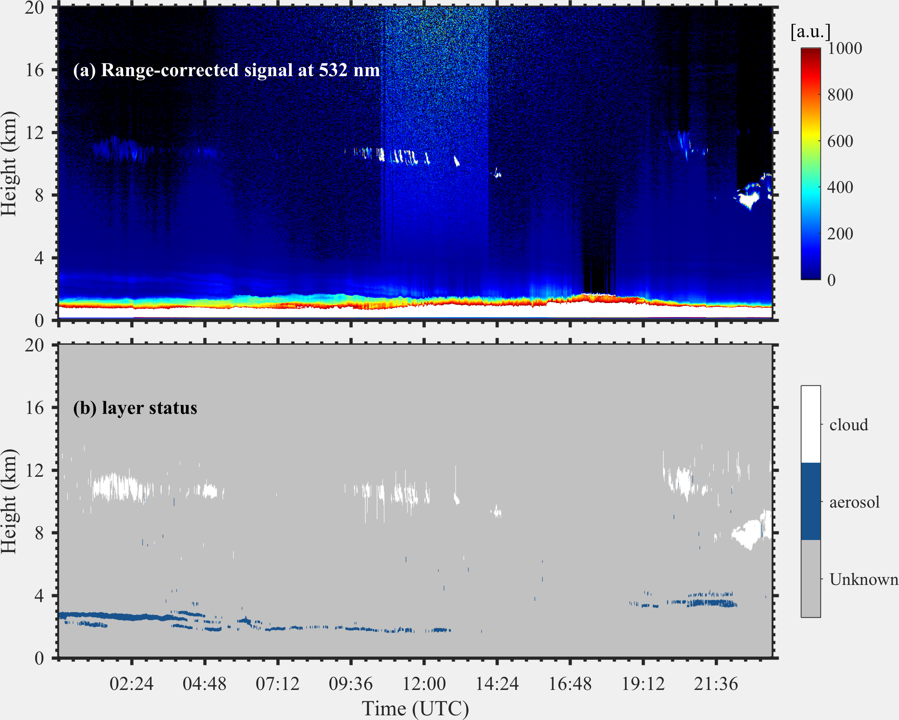

# Lidar Layer Detection Algorithms

 
<b>(a) Range-corrected signal; (b) layers detected by VDE algorithm [1]</b>

This repository collected some conventional published layer detection algorithms in recent years. As far as I know, most researchers didn't publish their code along with their papers. And it is really time-consuming to reproduce the results they've attached in their paper, taking into account some of the details could be missing in the document. Therefore, if you are only interested in the aerosol/cloud layers but don't want to waste your time in developing a sophisticated algorithm, this repository would be the one.

## Requirements

- MATLAB (> 2016b)
- Python (> 3.5) (under development)

## Run

> Since there are lots of algorithms which can do the job, however, each of them has its limitations. Before you choose the algorithm, Read the documents under [`docs`](./docs) to keep in mind which one would be the best for you.

Each algorithm has a very simple example under [`tests`](./tests), which you can follow to implement the respective algorithm in your programs.

## Contact

Zhenping Yin <zp.yin@whu.edu.cn>

## References

1. https://agupubs.onlinelibrary.wiley.com/doi/pdf/10.1002/2014JD021760